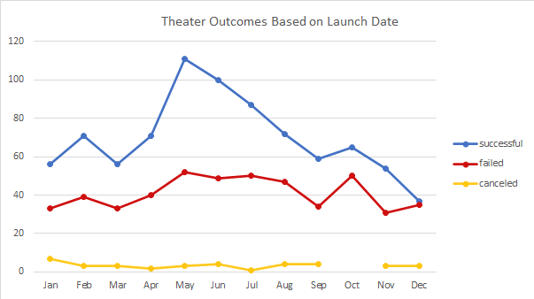
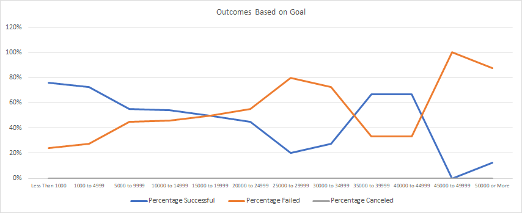

# Kickstarting Analysis

## Overview of Project

### Purpose
Louise requested to compare similar campaigns to her play after the play raised most of its fundraising goal in a short time from launch. During the beginning analysis, it was concluded that the fundraising goal and launch dates had an impact on a campaign’s outcome. This continued analysis looked at the goal and funding performance of similar play campaigns based on their launch dates. 

## Analysis and Challenges

### Analysis of Outcomes Based on Launch Date
This analysis uses a pivot table and pivot chart to show the number of successful, failed, and canceled campaigns with a Parent Category of “Theater” based on launch month. This highlights a month to month look at campaign outcome trends to determine what months bring the highest likelihood of success and/or lowest risk to failure.

### Analysis of Outcomes Based on Goals
This analysis uses a series of formulas as well as a line graph to show the percentage by successful, failed, and canceled outcomes for campaigns with similar goal ranges within the subcategory “plays”. This highlights the goal ranges that yield the highest success rates to determine what goals are realistic for success.

### Challenges and Difficulties Encountered
Although with this level of analysis there weren’t any large challenges or difficulties. The first of the smaller challenges came around combining through data, making sure the timestamps were changed to be readable times. Another difficulty was trying to understand what all the provided data fields meant. This was related to staff pick and spotlight meaning, looking at the titles of these fields I would assume that these should have been analyzed for impact on campaign outcome. The last challenge encountered was receiving zeros across all goal ranges for canceled campaigns for play outcomes based on goals. To confirm this was not a mistake the formulas were checked and original data was spot checked through filtering.

## Results

- **What are two conclusions you can draw about the Outcomes based on Launch Date?**

My first conclusion was there are more successful theater campaigns launched every month than failed campaigns with minimal campaigns being canceled per month. My second conclusion is that months May-July provide the highest number of successful theater campaigns but also some of the higher number of failed theater campaigns as well. This is due to these months having the largest number of launched campaigns, and with the failed campaigns size being more consistent, new campaigns should be launched in May or June.

- **What can you conclude about the Outcomes based on Goals?**

My conclusion is campaigns with a goal of $35,000 to $44,999 and $4,999 or less have a higher success rate. Due to the small sample size of campaigns with a goal in the range of $35,000 to $44,999, campaigns should stay under $5,000 unless the campaign must require more.

- **What are some limitations of this dataset?**

There are 2 limitations that come to mind with this dataset. The first being the limited sample size of plays with a goal of $25,000 or more. This makes the percent of outcomes possibly skewed by one strong play. The second being the blurb, and utilizing it to slice the plays by other characteristics such as professional or semi -professional, a re-write or new play, etc.

- **What are some other possible tables and/or graphs that we could create?**

One table and graph that could be made is to show the timespan of a campaign and how it relates to the outcome of the campaign. This would require a new field to be created with the amount of time between the launch and deadline dates. Then we could show a bar chart with the number of successful and failed “plays” campaigns where the run time broken out into the amount of months the campaign was live. This could provide insight on how long the campaign should be run to reach success as well.

We could have also filtered the current tables/graphs to highlight current trends vs. all historical data. If the year is 2017, could there be a chance that social norms changed from the campaign results seen in 2010? We could also build a new sheet where we look at each campaign by launch year and see if any of the outcomes based on launch month and/or goals changed over time.

Another table, as called out in the challenges section, we could analyze the relation of success and failed campaigns with the spotlight and staff picks to determine if being in these categories should be factored into campaign success. 

Lastly, we could look at how the number of backers factored for success/failed and compared that to average donation size. This might not be controllable when deciding how, when, and what campaign to launch but it could be interesting to see if successful campaigns are more dependent on a high number of backers or a high average donation. Granted the more in both is always the goal.

